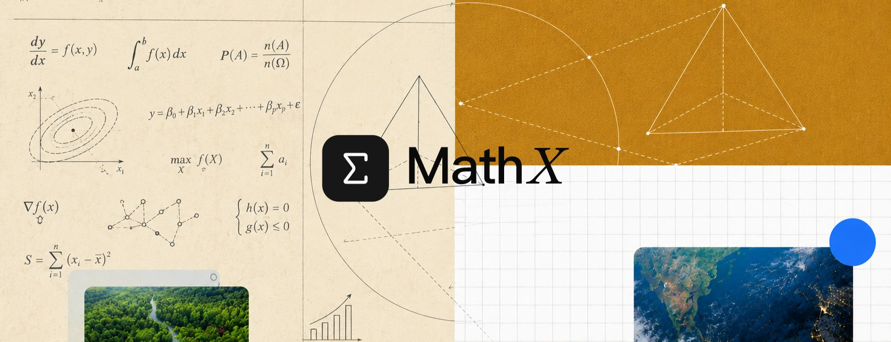

# MathX Math-Model Skills

[中文版](./README.md) (primary)



For modelers and researchers to help them build better mathematical models, papers, and figures.

Knowing whether you picked the right method — AHP or entropy-TOPSIS, ARIMA or grey prediction, a bar chart or a heatmap — is hard. These skills aim to help you get to those right decisions faster.

They are based on years of mathematical modeling and competition experience (MCM/国赛). Each skill lists the mistakes agents commonly make with that method and how to fix them.

## Install
[](https://www.skills.sh/chaobo8484/MathX-math-model-skills)

```bash
npx skills@latest add chaobo8484/MathX-math-model-skills
npx skills add chaobo8484/MathX-math-model-skills
```

Works with Claude Code, Codex, and OpenCode. Claude Code can also install it as a managed plugin via the marketplace (`.claude-plugin/marketplace.json`).

> Requirements: `python >=3.10` (gate scripts use `X | None` syntax). Check with `python --version`.

Shared vocabulary lives in [CONTEXT.md](./CONTEXT.md) — skills assume its terms. Run `/setup-mathx` once per project before the others.

## Why use it?

Agents don't have modeling judgment.

They run AHP without ever checking CR, fit ARIMA on 8 data points, draw 3D pie charts for time series, and cite references that don't exist. All these small things compound and make your paper either convincing, or just... not that rigorous.

These skills encode the checks that make each method defensible: consistency ratios, stationarity diagnostics, sample-size gates, and what-not-to-do lists. A shortcut to papers that survive review.

## Reference

Invocation: user-invoked = you type it; model-invoked = the agent fires it on its own.

| Entry point | What it does | Invocation |
|---|---|---|
| [ask-mathx](./skills/ask-mathx/SKILL.md) | Start here when you don't know which skill fits: it picks 1–2 and orders them | user-invoked |
| [setup-mathx](./skills/setup-mathx/SKILL.md) | Run once per project: binds the data dir, template, plotting and evidence backends | user-invoked |

### Modeling

| Skill | What it does | Invocation |
|---|---|---|
| [ingest-inputs](./skills/ingest-inputs/SKILL.md) | Normalize user files: CSV/XLSX/TXT/PDF parsing, JPG classify-digitize-or-describe, MP4 frame extraction, with quality report | model-invoked |
| [ahp](./skills/ahp/SKILL.md) | Pairwise-comparison hierarchy with consistency check (CR < 0.1) | model-invoked |
| [evaluation-entropy-topsis](./skills/evaluation-entropy-topsis/SKILL.md) | Objective entropy weights + TOPSIS closeness, no subjective input | model-invoked |
| [gray-prediction](./skills/gray-prediction/SKILL.md) | GM(1,1) forecast for tiny near-exponential samples (4–10 pts) | model-invoked |
| [time-series-arima](./skills/time-series-arima/SKILL.md) | ARIMA/SARIMA for evenly-spaced series (≈30+ pts), diagnostics + backtest | model-invoked |
| [bp-neural-network](./skills/bp-neural-network/SKILL.md) | Backprop feedforward net, train/validation split and early stopping | model-invoked |
| [regression-family](./skills/regression-family/SKILL.md) | OLS, ridge, Lasso, Logistic with EDA/VIF and CV-selected regularization | model-invoked |
| [clustering-classification](./skills/clustering-classification/SKILL.md) | KMeans/DBSCAN groups + random-forest labels, elbow/silhouette + stratified CV | model-invoked |
| [genetic-algorithm](./skills/genetic-algorithm/SKILL.md) | Selection/crossover/mutation for non-convex combinatorial optimization | model-invoked |
| [optimization-lp-milp](./skills/optimization-lp-milp/SKILL.md) | Linear objectives + integer decisions to a reproducible solver | model-invoked |
| [monte-carlo-simulation](./skills/monte-carlo-simulation/SKILL.md) | Probabilities, expectations, and risk by random sampling | model-invoked |
| [differential-equation](./skills/differential-equation/SKILL.md) | ODE integration + finite differences for continuous evolution | model-invoked |
| [graph-network](./skills/graph-network/SKILL.md) | Shortest paths, max flow, centrality, communities | model-invoked |

### Writing

| Skill | What it does | Invocation |
|---|---|---|
| [literature-review](./skills/literature-review/SKILL.md) | Retrieval, dedup, theming into a traceable gap table | user-invoked |
| [paper-outline](./skills/paper-outline/SKILL.md) | Chapter structure + Claim-Evidence-Link storyline | user-invoked |
| [latex-typesetting](./skills/latex-typesetting/SKILL.md) | Block-by-block template filling, compile to PDF via log iteration; DOCX branch for drafts | user-invoked |
| [citation-bibliography](./skills/citation-bibliography/SKILL.md) | Clean BibTeX, two-way in-text ↔ list integrity | user-invoked |
| [figure-table-generation](./skills/figure-table-generation/SKILL.md) | Captioned, cited figures and booktabs tables | user-invoked |
| [polish-proofread](./skills/polish-proofread/SKILL.md) | Unified terminology, tense, voice, caption style (CN–EN) | user-invoked |
| [reproducibility-checklist](./skills/reproducibility-checklist/SKILL.md) | Pre-submission gate: env, seeds, data, code, figures, reviewer angles | user-invoked |

### Research

| Skill | What it does | Invocation |
|---|---|---|
| [conjecture-formulation](./skills/conjecture-formulation/SKILL.md) | Patterns into falsifiable mathematical claims | model-invoked |
| [proof-assistant](./skills/proof-assistant/SKILL.md) | Lemma splits with explicitly marked unverified gaps | model-invoked |
| [symbolic-computation](./skills/symbolic-computation/SKILL.md) | SymPy simplify/differentiate/integrate/solve + LaTeX export | model-invoked |
| [numerical-verification](./skills/numerical-verification/SKILL.md) | Boundary scans grade evidence SUPPORTED/OPEN/REFUTED | model-invoked |
| [counterexample-search](./skills/counterexample-search/SKILL.md) | Brute force + pruning + heuristics for minimal counterexamples | model-invoked |
| [arxiv-literature-synthesis](./skills/arxiv-literature-synthesis/SKILL.md) | Field evolution, theorem dependencies, open problems from citations | model-invoked |
| [research-evidence](./skills/research-evidence/SKILL.md) | External evidence per claim via backend ladder; Firecrawl for deep crawl only | model-invoked |

### Visualization

| Skill | What it does | Invocation |
|---|---|---|
| [chart-decision](./skills/chart-decision/SKILL.md) | Chart choice by data type + goal, misleading encodings rejected | model-invoked |
| [scientific-plotting](./skills/scientific-plotting/SKILL.md) | Colorblind-safe static vector figures (Matplotlib/Seaborn) | model-invoked |
| [statistical-plot](./skills/statistical-plot/SKILL.md) | Distributions, tests, residuals, ROC with N, p-values, CIs | model-invoked |
| [plotly-interactive](./skills/plotly-interactive/SKILL.md) | Zoom/hover/linked Plotly charts, downsampled past 10k points | model-invoked |
| [publication-figure](./skills/publication-figure/SKILL.md) | Journal-compliant multi-panel figures (width, DPI, fonts) | model-invoked |
| [diagram-schematic](./skills/diagram-schematic/SKILL.md) | Editable schematics, flowcharts, network diagrams | model-invoked |

## License

This project is licensed under the MIT License, see [LICENSE](./LICENSE).
